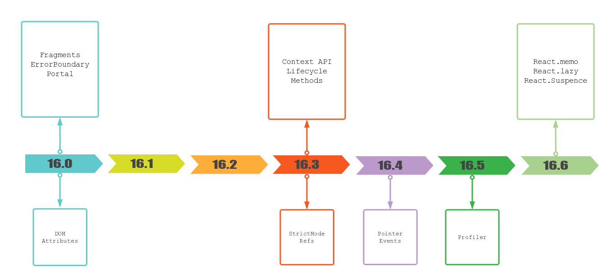
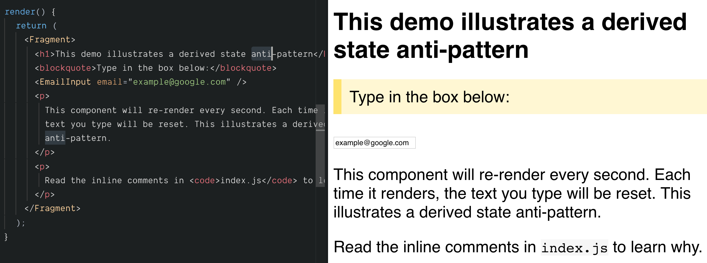
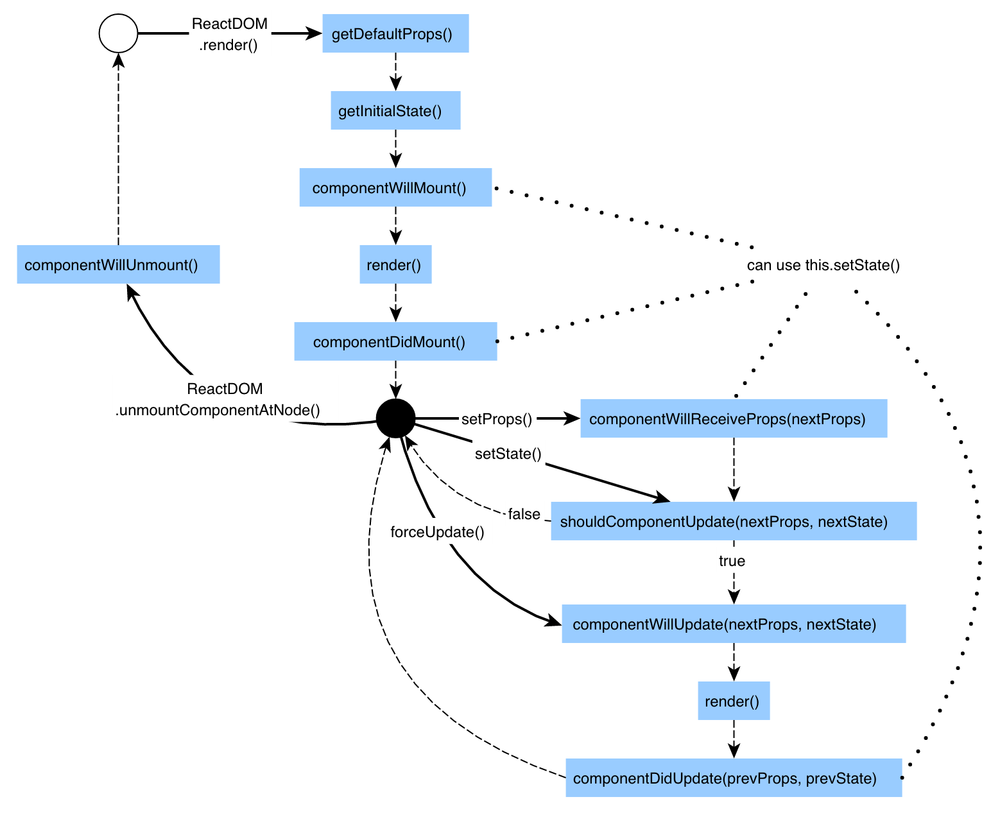
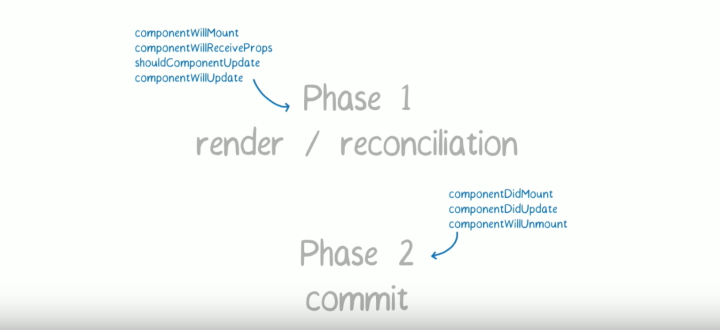

```notes
export { future as theme } from 'mdx-deck/themes'
export { dark as theme } from 'mdx-deck/themes'
export { light as theme } from 'mdx-deck/themes'
export { yellow as theme } from 'mdx-deck/themes'
```

export { swiss as theme } from "mdx-deck/themes";

# React 16 新特性

---



```notes
可以看到 16.0、16.3、16.6 本身是几次比较大的 release，包含了一些重要的特性。
```

---

# 几个比较重要的 feature

- [x] (16.0) `Fragments`
- [x] (16.0) `ErrorBoundary`
- [ ] (16.0) `Portal`
- [x] (16.3) `Context` API
- [x] (16.3) Lifecycle Methods
- [x] (16.6) `React.memo`
- [x] (16.6) `React.lazy` & `React.Suspence`

---

# 小 feature

- (16.0) DOM Attributes
- (16.3) `React.StrictMode`
- (16.3) `React.createRefs` & `React.forwardRefs`
- (16.4) Pointer Events
- (16.5) Profiler

---

# `Fragments`

```jsx
render() {
  return (
    // Extraneous div element :(
    <div>
      Some text.
      <h2>A heading</h2>
      More text.
      <h2>Another heading</h2>
      Even more text.
    </div>
  );
}
```

```notes
* 是个啥：以往 React component 只能返回一个根元素 `<div></div>`
* 解决了什么问题：现在可以返回数组和字符串了
```

---

```jsx harmony
render() {
  return [
    "Some text.",
    <h2 key="heading-1">A heading</h2>,
    "More text.",
    <h2 key="heading-2">Another heading</h2>,
    "Even more text."
  ];
}
```

---

```jsx harmony
render() {
  return (
    <>
      <span>Some text.</span>
      <h2>A heading</h2>
      <span>More text.</span>
      <h2>Another heading</h2>
      <span>Even more text.</span>
    </>
  )
}
```

---



---

```jsx harmony
function Glossary(props) {
  return (
    <dl>
      {props.items.map(item => (
        // Without the `key`, React will fire a key warning
        <Fragment key={item.id}>
          <dt>{item.term}</dt>
          <dd>{item.description}</dd>
        </Fragment>
      ))}
    </dl>
  );
}
```

```notes
* 采用建议：采用
* 迁移建议：所有多余 div 的场景都可以替代；但 div 是为了控制样式的情况下，可以不替换
```

---

# `ErrorBoundary`


```notes
* 是个啥：React 层一旦出现 JS 错误，会留下不一致的 UI 状态，并且导致应用崩溃
```

---

```jsx harmony
class ErrorBoundary extends React.Component {
  constructor(props) {
    super(props);
    this.state = { hasError: false };
  }

  componentDidCatch(error, info) {
    this.setState({ hasError: true });
    logErrorToMyService(error, info);
  }

  render() {
    if (this.state.hasError) {
      return <h1>Something went wrong.</h1>;
    }
    return this.props.children;
  }
}
```

---

```jsx harmony
<ErrorBoundary>
  <MyWidget />
</ErrorBoundary>
```

```notes
* 解决了什么问题：
  * 提供更好的 fallback UI
  * 可以在其中搜集错误信息
  * 由此导致的各种 `_.get()` 保护性编程
* 采用建议：可用
* 迁移建议：如果有场景，可以先在根组件下包一层，提供友好一些的出错信息
```

---

# `Portal`

```notes
很遗憾，这个部分我也不是很明白
```

---

```notes
据说使用场景是用来创建不直接附属于文档流的组件。多用于全局 Modal, Popup 等组件
```

---

# `Context` API

```notes
* 是个啥：是个数据方案。是 React state 和 redux 等数据管理方案的一个中间方案。它用来解决一个什么问题呢？多层、跨组件的数据传递问题。首先大家对数据透传 (props drilling) 这个现象有没有了解？有没有过工程感觉？
```

---

```jsx harmony
class App extends React.Component {
  render() {
    return <Toolbar theme="dark" />;
  }
}

function Toolbar(props) {
  return (
    <div>
      <ThemedButton theme={props.theme} />
    </div>
  );
}

class ThemedButton extends React.Component {
  render() {
    return <Button theme={this.props.theme} />;
  }
}
```

---

- props drilling (props 透传问题)
- 跨组件状态共享 问题

```notes
在这个地方呢，其实就有几个解决方案，但显然都不够优雅：

* 层层传递
* 回调（从下往上传）
* 全局数据（显然是坏味道，还要自己手造一套设施）
* redux 等数据管理工具（太重）
```

---

## Old `Context` API

```jsx harmony
import PropTypes from "prop-types";

class Button extends React.Component {
  render() {
    return (
      <button style={{ background: this.context.color }}>
        {this.props.children}
      </button>
    );
  }
}

Button.contextTypes = {
  color: PropTypes.string
};
```

---

```jsx harmony
class Message extends React.Component {
  render() {
    return (
      <div>
        {this.props.text} <Button>Delete</Button>
      </div>
    );
  }
}

class MessageList extends React.Component {
  getChildContext() {
    return { color: "purple" };
  }

  render() {
    const children = this.props.messages.map(message => (
      <Message text={message.text} />
    ));
    return <div>{children}</div>;
  }
}

MessageList.childContextTypes = {
  color: PropTypes.string
};
```

```notes
这页要缩小一下才能看见全部代码。
```

---

## 旧方案的问题

- 会被 `shouldComponentUpdate` 拦截
- 降低了组件的可复用性、模块化
- API 是非常不 React(声明式) 的魔法，调试较困难

---

## 新的 `Context` API

```jsx harmony
const ThemeContext = React.createContext("light");

class ThemeProvider extends React.Component {
  state = { theme: "light" };

  render() {
    return (
      <ThemeContext.Provider value={this.state.theme}>
        {this.props.children}
      </ThemeContext.Provider>
    );
  }
}

class ThemedButton extends React.Component {
  render() {
    return (
      <ThemeContext.Consumer>
        {theme => <Button theme={theme} />}
      </ThemeContext.Consumer>
    );
  }
}
```

---

## 使用场景 / 会否取代 Redux？

- 适用于较简单的只读数据：本地化、配置、偏好、主题、当前登录用户等
- 不会取代 redux

---

## Caveats

浅比较 - 避免重复渲染

```jsx harmony
class App extends React.Component {
  render() {
    return (
      <Provider value={{ something: true }}>
        <Toolbar />
      </Provider>
    );
  }
}
```

---

# Lifecycle Methods

---



---


---


---

- `getDerivedStateFromProps`：用来取代 `componentWillReceiveProps`
- `getSnapshotBeforeUpdate`：日常基本没有使用场景。官方举了个 scroll 的例子

---

为什么要替代掉 `componentWillReceiveProps`？

- 以前是唯一可以监听到 props 变化的地方，往往会放很多逻辑（如检测变化、更新数据、副作用、更新 state 等）
- `getDerivedStateFromProps(nextProps, prevState)` 明确了适用场景：仅检测变化、更改 state
- 更新数据、副作用拆到 `componentDidUpdate` 里去做

---

## 官方 demo

```jsx harmony
class EmailInput extends Component {
  state = {
    email: this.props.defaultEmail,
    prevPropsUserID: this.props.userID
  };

  static getDerivedStateFromProps(props, state) {
    if (props.userID !== state.prevPropsUserID) {
      return {
        prevPropsUserID: props.userID,
        email: props.defaultEmail
      };
    }
    return null;
  }
}
```

---

为什么要替代掉 `componentWillMount`？

- 在此获取数据也没用，此时 `render` 函数已经执行了，白屏是必然的
- React 的异步渲染 async rendering 开启后，这部分可能被多次打断又执行
- 似乎 SSR 时会有些问题

---

迁移建议：

1. 官方迁移路线：`UNSAFE_`
2. 考虑安全将 `componentWillMount/Update` 替换成 `componentDidMount/Update`
3. 逐步替换 `componentWillReceiveProps`

```notes
1. 16.3 开始，这三个方法跟 `UNSAFE_` 前缀的可以一起用
2. 16.x 开始，这三个方法仍可以一起用，但老的三个方法会开始在控制台报 warning
3. 17.x 开始，老的三个方法就不能用了，但是 `UNSAFE_` 前缀的方法仍然可以用
```

---

- https://reactjs.org/blog/2018/03/27/update-on-async-rendering.html
- https://reactjs.org/blog/2018/06/07/you-probably-dont-need-derived-state.html

---

# Fiber

---


---


---



---

- https://zhuanlan.zhihu.com/p/26027085

---

# `React.memo`

```jsx harmony
const MyComponent = React.memo(function MyComponent(props) {
  /* only re-renders if props change */
});
```

---

# `React.lazy` & `React.Suspence`

```jsx harmony
import React, { lazy, Suspense } from "react";
const OtherComponent = lazy(() => import("./OtherComponent"));

function MyComponent() {
  return (
    <Suspense fallback={<div>Loading...</div>}>
      <OtherComponent />
    </Suspense>
  );
}
```

---

- (16.0) DOM Attributes
- (16.3) `React.StrictMode`
- (16.3) `React.createRefs` & `React.forwardRefs`
- (16.4) Pointer Events
- (16.5) Profiler

---

## `React.StrictMode`

- 识别被标志位不安全的生命周期函数
- 对弃用的 API 进行警告
- 探测某些产生副作用的方法
- 检测是否采用了老的 Context API

---

- https://zhuanlan.zhihu.com/p/38030418
- https://zhuanlan.zhihu.com/p/50597236

---
